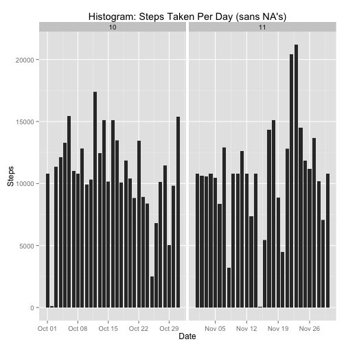

Reproducible Research: Peer Assessment 1
-------------------------------------------
Created by S. A. Batla on 2015 November 15


## Loading libraries

```r
library(ggplot2)
library(lattice)
```

## Loading and preprocessing the data

```r
unzip("activity.zip")
data <- read.csv("activity.csv", colClasses = c("integer", "Date", "factor"))
data$month <- as.numeric(format(data$date, "%m"))
dataNoNA <- na.omit(data)
rownames(dataNoNA) <- 1:nrow(dataNoNA)
```
## What is mean total number of steps taken per day?
### Histogram of steps taken per day

```r
ggplot(dataNoNA, aes(date, steps)) + geom_bar(stat = "identity",  width = .8) + facet_grid(. ~ month, scales = "free") + labs(title = "Histogram: Steps Taken Per Day", x = "Date", y = "Steps")
```

 
### Total steps

```r
totalSteps <- aggregate(dataNoNA$steps, list(Date = dataNoNA$date), FUN = "sum")$x
```
### Mean of steps taken per day

```r
mean(totalSteps)
```

```
## [1] 10766.19
```
### Median of steps taken per day

```r
median(totalSteps)
```

```
## [1] 10765
```
## What is the average daily activity pattern?

```r
avgSteps <- aggregate(dataNoNA$steps, list(interval = as.numeric(as.character(dataNoNA$interval))), FUN = "mean")

names(avgSteps)[2] <- "meanOfSteps"
```
### Make a time series plot (i.e. type = "l") of the 5-minute interval (x-axis) and the average number of steps taken, averaged across all days (y-axis)

```r
ggplot(avgSteps, aes(interval, meanOfSteps)) + geom_line(size = 0.8) + labs(title = "Time Series Plot: 5-minute Interval", x = "5-minute intervals", y = "Average Number of Steps Taken")
```

 
### Which 5-minute interval, on average across all the days in the dataset, contains the maximum number of steps?

```r
avgSteps[avgSteps$meanOfSteps == max(avgSteps$meanOfSteps), ]
```

```
##     interval meanOfSteps
## 104      835    206.1698
```
## Imputing missing values
### Calculate and report the total number of missing values in the dataset (i.e. the total number of rows with NAs)

```r
sum(is.na(data))
```

```
## [1] 2304
```
### Strategy for filling NAs - using mean for that 5-minute interval approach

```r
completeData <- data 
for (i in 1:nrow(completeData)) {
    if (is.na(completeData$steps[i])) {
        completeData$steps[i] <- avgSteps[which(completeData$interval[i] == avgSteps$interval), ]$meanOfSteps
    }
}
```
### verify no NA's

```r
sum(is.na(completeData))
```

```
## [1] 0
```
### Make Histogram after data is filled in

```r
ggplot(newData, aes(date, steps)) + geom_bar(stat = "identity", width = 0.8) + facet_grid(. ~ month, scales = "free") + labs(title = "Histogram: Steps Taken Per Day (sans NA's)", x = "Date", y = "Steps")
```

 
### Examine impact of imputing, compare old mean/median with new mean/median

```r
newTotalSteps <- aggregate(newData$steps, list(Date = newData$date), FUN = "sum")$x

newMean <- mean(newTotalSteps)
newMedian <- median(newTotalSteps)
oldMean <- mean(totalSteps)
oldMedian <- median(totalSteps)
```
### Difference in Mean is now zero, since we filled missing values with mean of that 5-minute intervals. New Median is greater, as was expected

```r
newMean - oldMean
```

```
## [1] 0
```

```r
newMedian - oldMedian
```

```
## [1] 1.188679
```
## Are there differences in activity patterns between weekdays and weekends?

```r
completeData$weekdays <- factor(format(completeData$date, "%A"))
levels(completeData$weekdays)
```

```
## [1] "Friday"    "Monday"    "Saturday"  "Sunday"    "Thursday"  "Tuesday"  
## [7] "Wednesday"
```

```r
levels(completeData$weekdays) <- list(weekday = c("Monday", "Tuesday","Wednesday", 
                                                  "Thursday", "Friday"), 
                                                  weekend = c("Saturday", "Sunday"))
levels(completeData$weekdays)
```

```
## [1] "weekday" "weekend"
```

```r
table(completeData$weekdays)
```

```
## 
## weekday weekend 
##   12960    4608
```
### There are major differences in activity patterns between weekends and
### weekdays in the 500-20000 interval range

```r
avgSteps <- aggregate(completeData$steps, 
                      list(interval = as.numeric(as.character(completeData$interval)),
                      weekdays = completeData$weekdays), FUN = "mean")
                      
names(avgSteps)[3] <- "meanOfSteps"

xyplot(avgSteps$meanOfSteps ~ avgSteps$interval | avgSteps$weekdays, 
        layout = c(1, 2), type = "l", xlab = "Interval", ylab = "Steps")
```

 
